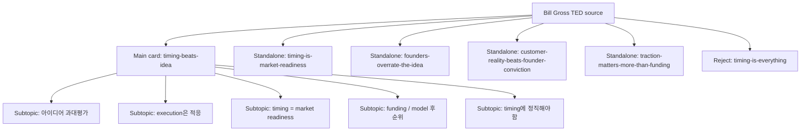

# Planning Review - The single biggest reason why start-ups succeed

## Source Snapshot
- sourceId: bill-gross-startup-success-timing
- brand: richesse-club
- sourceType: youtube
- input: https://www.youtube.com/watch?v=bNpx7gpSqbY&t=1s
- transcript status: corrected local transcript available in source folder
- estimated length: 6m 21s
- planning note: 이 소스는 `창업 성공의 핵심 변수`를 다루는 직접적인 startup material이다. richesse-club 기준으로는 `아이디어보다 타이밍`, `시장 준비도`, `고객이 주는 현실`, `자금보다 traction` 같은 인사이트를 summary형으로 정리하기 좋다.

## Core Theme
- main thesis: 스타트업의 성패는 창업자가 가장 숭배하는 `아이디어`보다, 시장이 그 아이디어를 받아들일 준비가 되었는지라는 `타이밍`에서 더 크게 갈린다.
- why this source matters: 많은 창업자는 아이디어의 독창성이나 투자 유치에 집착하지만, 실제로는 시장의 준비도와 고객 반응이 훨씬 큰 변수가 된다.
- editorial opportunity: richesse-club 톤으로 가져가면 `아이디어 숭배 해체`, `시장 준비도`, `고객이 주는 현실`, `자금보다 타이밍` 같은 startup 인사이트를 밀도 있게 요약할 수 있다.

## Insight Extraction
- raw insight count: 12
- filtered usable insight count: 7
- summary-style carousel viability: yes; cover 제외 `5`장 이상을 안정적으로 구성할 수 있다

### Raw Insights
- Bill Gross는 스타트업 성공 요인을 아이디어, 팀/실행, 비즈니스 모델, 자금, 타이밍 다섯 축으로 봤다
- 그는 원래 아이디어가 전부라고 믿었지만 실제로는 그렇지 않다고 결론 내렸다
- 실행의 핵심은 계획 고수가 아니라 고객에게 맞춰 적응하는 능력이다
- 고객이 진짜 현실이고, 팀은 그 현실에 얼마나 빨리 반응하느냐가 중요하다
- 비즈니스 모델은 초기에 완벽하지 않아도 나중에 붙일 수 있다
- 자금은 생각보다 결정적이지 않고, traction이 생기면 뒤따라오기 쉽다
- 타이밍은 시장이 그 제품을 받아들일 준비가 되었는지의 문제다
- Bill Gross의 비교에서는 타이밍이 성공과 실패의 차이 중 42%를 설명했다
- Airbnb는 불황기라는 맥락이 있었기에 낯선 공유 모델이 받아들여질 수 있었다
- Uber는 운전자가 추가 수입을 원하던 시점과 맞물렸다
- Z.com은 영상 인프라가 아직 성숙하지 않아 너무 일렀다
- YouTube는 광대역과 Flash가 준비된 뒤 등장해 같은 영역에서 훨씬 유리한 타이밍을 가졌다

### Filter Notes
- merged:
  - `실행은 적응 능력이다` + `고객이 진짜 현실이다`
  - `비즈니스 모델은 나중에 붙일 수 있다` + `자금보다 traction이 중요하다`
  - `Airbnb/Uber/YouTube/Z.com 사례`는 하나의 `시장 준비도 사례 묶음`으로 통합
- cut:
  - `다섯 축으로 봤다`
  - 이유: 방법론 설명으로는 유효하지만 슬라이드 메시지로는 약하다
  - `Bill Gross의 개인적 생각 변화`
  - 이유: 핵심 인사이트의 배경 설명이지 독립 슬라이드로 세우기엔 약하다

### Richesse Scoring Summary

| insight | Brand Fit (1-5) | Content Value (1-5) | Novelty (1-5) | Evidence Strength (1-5) | Slide-worthiness (1-5) | keep / cut |
| --- | --- | --- | --- | --- | --- | --- |
| 스타트업의 승패는 아이디어보다 타이밍이 먼저 가른다 | 5 | 5 | 4 | 5 | 5 | keep |
| 실행은 계획 고수보다 고객 현실에 맞춰 적응하는 능력이다 | 5 | 5 | 4 | 5 | 5 | keep |
| 시장 준비도는 아이디어의 질과 별개의 문제다 | 5 | 5 | 4 | 5 | 5 | keep |
| 자금과 비즈니스 모델은 생각보다 뒤에 오는 변수일 수 있다 | 5 | 4 | 4 | 4 | 4 | keep |
| traction이 생기면 자금은 뒤따라오기 쉬워진다 | 4 | 4 | 3 | 4 | 4 | keep |
| 같은 아이디어도 시대가 다르면 결과가 완전히 달라진다 | 5 | 5 | 4 | 5 | 5 | keep |
| 창업자는 타이밍을 가장 정직하게 봐야 한다 | 5 | 5 | 4 | 5 | 4 | keep |
| 다섯 가지 변수로 볼 수 있다 | 3 | 3 | 2 | 5 | 2 | cut |
| Bill Gross도 처음엔 아이디어를 숭배했다 | 4 | 3 | 2 | 4 | 2 | cut |

## Main Topic
### Umbrella Slide Subtopics
- 왜 창업자는 아이디어를 과대평가하는가
  - role in main card: 첫 문제 정의
  - why it stays inside the main card: 이 포인트만 따로 떼면 흔한 조언처럼 보이지만, timing 논지 안에서 다뤄야 힘이 생긴다.
- 실행의 본질은 고객 현실에 적응하는 능력이라는 점
  - role in main card: 아이디어 다음으로 중요한 축 정리
  - why it stays inside the main card: timing과 execution의 관계를 같이 볼 때 메시지가 선명하다.
- 시장 준비도가 아이디어보다 더 큰 차이를 만드는 이유
  - role in main card: 메인 주장
  - why it stays inside the main card: 이 카드의 중심 문장이므로 메인 카드 안에 있어야 한다.
- 자금과 비즈니스 모델은 왜 생각보다 후순위일 수 있는가
  - role in main card: 통념 해체
  - why it stays inside the main card: timing 중심 구조 안에서 반전 포인트로 작동한다.
- 결국 창업자는 무엇보다 타이밍에 정직해야 한다
  - role in main card: 결론과 행동 기준
  - why it stays inside the main card: 단독 카드도 가능하지만 메인 카드의 마무리 문장으로 더 강하다.

### Standalone-Worthy Subtopics
- `timing-is-market-readiness`
  - standalone angle: 타이밍은 운이 아니라 시장이 준비됐는지를 읽는 문제다
  - why it can survive on its own: startup 창업자에게 가장 실무적으로 바로 닿는 메시지다
  - relation to the main card: 메인 카드의 중심 주장을 더 정교하게 확장한 버전
- `founders-overrate-the-idea`
  - standalone angle: 창업자는 왜 여전히 아이디어를 가장 중요한 변수라고 착각하는가
  - why it can survive on its own: myth-busting 구조가 분명해서 richness식 카드로 설 수 있다
  - relation to the main card: 메인 카드의 도입 문제 정의를 확장한 버전
- `customer-reality-beats-founder-conviction`
  - standalone angle: 실행은 내 계획을 밀어붙이는 능력이 아니라 고객 현실에 맞춰 바뀌는 능력이다
  - why it can survive on its own: execution에 대한 오해를 바로잡는 한 편의 카드로 충분하다
  - relation to the main card: 메인 카드의 execution 파트를 독립형으로 확장한 버전
- `traction-matters-more-than-funding`
  - standalone angle: 초기 자금보다 중요한 것은 시장이 실제로 당기고 있는지다
  - why it can survive on its own: startup 운영자에게 즉각적으로 유용한 메시지다
  - relation to the main card: funding/business model 파트를 운영 관점으로 확장한 버전

## Packaging Map

## Candidate Scoreboard
| candidateId | packaging | priority | slides | status | note |
| --- | --- | --- | --- | --- | --- |
| `timing-beats-idea` | umbrella | P1 | 7 | ready | source 전체를 가장 잘 보존하는 메인 카드 |
| `timing-is-market-readiness` | standalone | P1 | 6 | ready | timing을 가장 정확하게 재정의하는 독립 카드 |
| `founders-overrate-the-idea` | standalone | P1 | 6 | ready | 가장 대중적으로 잘 읽히는 myth-busting 카드 |
| `customer-reality-beats-founder-conviction` | standalone | P2 | 6 | ready | execution에 대한 오해를 바로잡는 카드 |
| `traction-matters-more-than-funding` | standalone | P2 | 5 | ready | 운영자 관점에서 실용성이 높다 |
| `timing-is-everything` | reject | P3 | - | reject | 소스도 idea/execution의 중요성을 인정하므로 지나치게 단순화된 프레임이다 |

## Candidate Plans

### Main Card - Timing Beats Idea
- candidateId: `timing-beats-idea`
- workingTitle: 스타트업의 승패는 아이디어보다 타이밍이 먼저 가른다
- packaging: umbrella
- reviewStatus: ready
- slideCount: 7
- contentAngle: Bill Gross의 비교를 바탕으로 창업 성공을 가르는 핵심 변수가 아이디어의 brilliance보다 시장의 readiness였다는 점을 richness-club 톤으로 정리한다.
- whyItDeservesAPost: startup, execution, customer, funding, timing이 모두 들어 있고, richness가 좋아하는 `통념 해체형` 구조가 분명하다.
- recommendedPriority: P1

#### Audience
좋은 아이디어와 열심히 하는 실행만 있으면 된다고 믿는 초기 창업자, 제품 운영자, 스타트업 실무자

#### Core Message
스타트업은 아이디어가 좋다고 이기는 것이 아니라, 시장이 그 아이디어를 받아들일 준비가 되었을 때 비로소 크게 열린다.

#### Why Now
지금도 많은 팀은 제품의 완성도와 투자 유치에 집착하지만, 실제로는 시장이 아직 준비되지 않았다는 이유만으로도 실패할 수 있다.

#### Key Point 1
창업자는 본능적으로 아이디어를 과대평가하지만, 실제 성패는 훨씬 더 외부적인 변수에서 갈리는 경우가 많다.

#### Key Point 2
타이밍은 운이 아니라 `지금 시장이 이 문제를 받아들일 준비가 되었는가`라는 냉정한 판단의 문제다.

#### Key Point 3
그래서 execution, business model, funding도 중요하지만, 그 모든 것이 빛나려면 먼저 시장의 문이 열려 있어야 한다.

#### Hook
좋은 아이디어가 스타트업을 살리는 게 아니라, 맞는 타이밍이 아이디어를 살린다.

#### Closing Note
창업자는 자기 확신보다 시장의 준비도를 먼저 봐야 한다. 타이밍에 정직하지 않으면 brilliance도 너무 일찍 죽는다.

#### Slide Flow
- Slide 1 (Cover): 스타트업의 승패는 아이디어보다 타이밍이 먼저 가른다
- Slide 2: 우리는 왜 여전히 아이디어를 가장 중요한 변수라고 믿을까
- Slide 3: execution의 핵심은 계획 고수가 아니라 고객 현실에 대한 적응이다
- Slide 4: 시장 준비도는 아이디어의 질과 별개의 문제다
- Slide 5: 자금과 비즈니스 모델은 생각보다 후순위일 수 있다
- Slide 6: Airbnb, Uber, YouTube는 아이디어보다 타이밍의 힘을 보여준다
- Final: 창업자는 무엇보다 시장이 열렸는지에 정직해야 한다

#### Visual Direction
차분한 text-first editorial. startup / infrastructure / city / interface / movement를 암시하는 low-saturation 이미지나 그래프적 질감을 쓰되 정보 카드처럼 보이지 않게 정리한다.

### Standalone - Timing Is Market Readiness
- candidateId: `timing-is-market-readiness`
- workingTitle: 타이밍은 운이 아니라 시장 준비도의 문제다
- packaging: standalone
- reviewStatus: ready
- slideCount: 6
- contentAngle: timing을 추상적 운이 아니라 `시장 수용성의 타이밍`으로 재정의한다.
- whyItDeservesAPost: startup 창업자에게 바로 적용 가능한 판단 기준으로 쓸 수 있다.
- recommendedPriority: P1

#### Audience
제품 타이밍을 감으로만 판단하고 있는 창업자와 신사업 담당자

#### Core Message
타이밍은 행운의 문제가 아니라, 고객과 인프라와 시장 심리가 동시에 준비됐는지를 읽는 문제다.

#### Why Now
좋은 제품이 너무 일찍 나오거나 너무 늦게 나오면서 죽는 경우가 지금도 반복된다.

#### Key Point 1
시장 준비도는 아이디어의 brilliance와는 다른 차원의 변수다.

#### Key Point 2
너무 이르면 세상을 교육해야 하고, 너무 늦으면 경쟁이 이미 포화다.

#### Key Point 3
그래서 창업자는 제품보다 먼저 시장의 readiness를 읽어야 한다.

#### Hook
타이밍을 운이라고 부르는 순간, 시장을 읽는 책임도 같이 포기하게 된다.

#### Closing Note
시장이 열리지 않았는데 제품만 밀어붙이면, 문제는 execution이 아니라 timing일 수 있다.

#### Slide Flow
- Slide 1 (Cover): 타이밍은 운이 아니라 시장 준비도의 문제다
- Slide 2: 왜 많은 창업자는 timing을 너무 가볍게 보는가
- Slide 3: 너무 이른 제품은 세상을 먼저 교육해야 한다
- Slide 4: 너무 늦은 제품은 이미 경쟁이 가득하다
- Slide 5: 중요한 건 지금 고객이 정말 준비됐는지다
- Final: startup의 timing은 직감이 아니라 시장 읽기다

#### Visual Direction
도시, 흐름, 신호 같은 은유적 이미지와 넓은 여백. 설명보다 판단 기준처럼 읽히게 한다.

### Standalone - Founders Overrate The Idea
- candidateId: `founders-overrate-the-idea`
- workingTitle: 창업자는 아이디어를 과대평가한다
- packaging: standalone
- reviewStatus: ready
- slideCount: 6
- contentAngle: 창업자는 idea worship에 빠지기 쉽고, 그 착각이 시장 판단을 흐린다는 점을 다룬다.
- whyItDeservesAPost: startup myth-busting 카드로 대중성과 brand fit이 높다.
- recommendedPriority: P1

#### Audience
아이디어의 독창성만으로 승부가 난다고 믿는 예비 창업자와 초기 팀

#### Core Message
아이디어의 독창성은 중요하지만, 그것만으로 시장의 문을 열 수는 없다.

#### Why Now
창업 콘텐츠 대부분이 여전히 brilliant idea를 과장하고, 그 프레임이 현실 판단을 흐리게 만든다.

#### Key Point 1
많은 창업자는 아이디어를 사랑한 나머지 시장의 readiness를 과소평가한다.

#### Key Point 2
실패는 종종 아이디어 부족보다 맥락 오독에서 나온다.

#### Key Point 3
좋은 창업자는 아이디어 보호보다 시장 판단에 더 집요해야 한다.

#### Hook
창업자를 가장 쉽게 속이는 건 경쟁사가 아니라, 자기 아이디어에 대한 확신일 수 있다.

#### Closing Note
아이디어는 출발점이지만, 시장의 타이밍을 읽지 못하면 출발조차 너무 이르다.

#### Slide Flow
- Slide 1 (Cover): 창업자는 아이디어를 과대평가한다
- Slide 2: 우리는 왜 brilliant idea를 창업의 중심으로 믿을까
- Slide 3: 하지만 시장은 아이디어의 독창성만으로 열리지 않는다
- Slide 4: 고객이 준비되지 않으면 brilliance도 너무 일찍 죽는다
- Slide 5: 좋은 창업자는 아이디어보다 맥락을 더 냉정하게 본다
- Final: startup의 핵심은 aha moment보다 market moment에 가깝다

#### Visual Direction
질문형 헤드라인과 절제된 대비. 과장된 성장 그래프보다 조용한 긴장감이 있는 구성을 우선한다.

### Standalone - Customer Reality Beats Founder Conviction
- candidateId: `customer-reality-beats-founder-conviction`
- workingTitle: 고객의 현실은 창업자의 확신보다 강하다
- packaging: standalone
- reviewStatus: ready
- slideCount: 6
- contentAngle: execution을 `열심히 함`이 아니라 `고객 현실에 대한 적응`으로 재정의한다.
- whyItDeservesAPost: execution을 operational discipline이 아니라 market adaptation으로 읽게 해준다.
- recommendedPriority: P2

#### Audience
실행을 곧 속도와 노동 강도로 이해하는 창업자와 제품 리더

#### Core Message
실행은 계획을 지키는 능력이 아니라, 고객이 보여주는 현실에 맞춰 바뀌는 능력이다.

#### Why Now
많은 팀이 여전히 내부 확신만으로 밀어붙이다가 시장의 신호를 늦게 읽는다.

#### Key Point 1
고객은 계획대로 움직이지 않고, 바로 그 지점에서 execution의 실력이 갈린다.

#### Key Point 2
실행력은 빠른 제작보다 빠른 적응에 더 가깝다.

#### Key Point 3
그래서 founder conviction만 강한 팀보다 customer reality에 민감한 팀이 오래 간다.

#### Hook
실행력이 좋다는 말은 보통 너무 쉽게 쓰이지만, 진짜 execution은 적응력에 가깝다.

#### Closing Note
고객이 주는 펀치를 계속 무시하면, 문제는 아이디어보다 execution의 정의 자체일 수 있다.

#### Slide Flow
- Slide 1 (Cover): 고객의 현실은 창업자의 확신보다 강하다
- Slide 2: execution을 왜 우리는 너무 자주 속도로만 이해할까
- Slide 3: 고객은 항상 계획에 펀치를 날린다
- Slide 4: 그때 필요한 건 고집이 아니라 적응이다
- Slide 5: 창업자의 확신보다 시장의 반응이 더 정확하다
- Final: execution은 밀어붙임이 아니라 고객 현실에 맞춰 바뀌는 능력이다

#### Visual Direction
도식보다 문장 중심. 손, 화면, 이동, 도시 불빛 같은 억제된 startup 무드 이미지가 적합하다.

### Standalone - Traction Matters More Than Funding
- candidateId: `traction-matters-more-than-funding`
- workingTitle: 초기 자금보다 중요한 건 traction이다
- packaging: standalone
- reviewStatus: ready
- slideCount: 5
- contentAngle: funding을 startup success의 전제조건처럼 보는 프레임을 낮추고, 시장 당김이 먼저라는 점을 보여준다.
- whyItDeservesAPost: 실무적인 startup 판단 기준으로 유용하다.
- recommendedPriority: P2

#### Audience
투자 유치가 곧 startup validation이라고 믿는 초기 팀과 예비 창업자

#### Core Message
초기 자금은 중요하지만, 시장이 당기지 않는 제품엔 결국 오래 머물지 않는다.

#### Why Now
창업 담론이 여전히 funding 이벤트 중심으로 과장되는 반면, 실제 생존은 시장 반응에 더 크게 좌우된다.

#### Key Point 1
비즈니스 모델은 초기에 완벽하지 않아도 나중에 붙일 수 있다.

#### Key Point 2
자금도 traction이 생기면 상대적으로 더 쉽게 따라붙는다.

#### Key Point 3
그래서 팀은 투자보다 시장의 당김을 먼저 확인해야 한다.

#### Hook
돈이 먼저 와서 성공하는 팀보다, 시장이 먼저 반응해서 돈이 따라오는 팀이 더 강하다.

#### Closing Note
초기 startup의 진짜 신호는 잔고보다 당김이다.

#### Slide Flow
- Slide 1 (Cover): 초기 자금보다 중요한 건 traction이다
- Slide 2: 우리는 왜 funding을 성공의 첫 증거처럼 읽을까
- Slide 3: 하지만 비즈니스 모델과 자금은 뒤에서 붙을 수도 있다
- Slide 4: 먼저 봐야 할 건 시장이 실제로 당기고 있는지다
- Final: startup의 첫 증거는 투자보다 traction에 가깝다

#### Visual Direction
과장된 VC 무드보다, 실무적인 startup 문법에 맞는 restrained editorial 구성이 적합하다.

### Reject - Timing Is Everything
- candidateId: `timing-is-everything`
- workingTitle: 결국 스타트업은 타이밍이 전부다
- packaging: reject
- reviewStatus: reject
- slideCount: -
- contentAngle: timing만이 유일한 변수라는 단정형 카드
- whyItDeservesAPost: 소스는 timing을 가장 큰 변수로 보지만, execution과 idea의 중요성도 분명히 인정한다.
- recommendedPriority: P3

## Recommended Route
- main card recommendation: `timing-beats-idea`
- why: 이 소스의 핵심 주장과 사례 묶음을 가장 잘 보존하면서도 richness가 좋아하는 통념 해체형 구조로 정리된다.
- standalone expansion candidates: `timing-is-market-readiness`, `founders-overrate-the-idea`, `customer-reality-beats-founder-conviction`
- hold: `traction-matters-more-than-funding`
- reject: `timing-is-everything`

## Approval Guide
- main card: `timing-beats-idea`
- standalone candidates: `timing-is-market-readiness`, `founders-overrate-the-idea`, `customer-reality-beats-founder-conviction`
- spawn now: none yet; owner review 이후 `mainCandidateId`, `standaloneCandidateIds`, `approvedCandidateIds`를 선택한 뒤 spawn 하는 것이 맞다
- hold: `traction-matters-more-than-funding`
- reject: `timing-is-everything`
- next step after approval: `source.json.analysis.mainCandidateId`, `standaloneCandidateIds`, `approvedCandidateIds`를 선택한 뒤 `source.json.status`를 `approved`로 바꾸고 `npm run spawn:approved -- bill-gross-startup-success-timing`를 실행한다.
