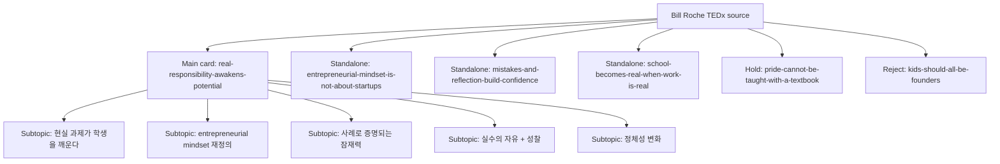

# Planning Review - The Power of an Entrepreneurial Mindset

## Source Snapshot
- sourceId: bill-roche-power-of-entrepreneurial-mindset
- brand: richesse-club
- sourceType: youtube
- input: https://www.youtube.com/watch?v=Ihs4VFZWwn4&t=1s
- transcript status: corrected local transcript available in source folder
- estimated length: 16m 21s
- planning note: 기존 루트 VTT는 이 영상과 다른 내용이었고, 실제 영상 중심은 `과로/회복`이 아니라 `학생에게 실제 책임과 의사결정권을 부여해 entrepreneurial mindset를 기르는 교육`에 가깝다.

## Core Theme
- main thesis: entrepreneurial mindset는 창업을 권하는 수업이 아니라, 젊은 사람이 현실 문제를 풀고 스스로 가능성을 믿게 만드는 경험 설계에서 자란다.
- why this source matters: 많은 교육 콘텐츠는 여전히 지식 전달에 머물러 있지만, 이 강연은 학생이 실제 책임을 맡을 때 태도와 정체성이 어떻게 바뀌는지를 구체적 사례로 보여준다.
- editorial opportunity: richesse-club 톤으로 가져가면 `아이에게 필요한 미래 역량`, `책임과 자율이 잠재력을 깨우는 방식`, `실패를 허용하는 교육 설계`라는 세 축으로 정리하기 좋다.

## Insight Extraction
- raw insight count: 12
- filtered usable insight count: 7
- summary-style carousel viability: yes; cover 제외 `5`장 이상을 안정적으로 구성할 수 있다

### Raw Insights
- 교실에서 무기력한 학생도 실제 책임을 맡으면 태도가 달라질 수 있다
- entrepreneurial mindset는 창업 자체보다 변화 대응력과 주도성의 문제다
- 실제 프로젝트는 학생의 창의성과 문제 해결력을 더 빨리 드러낸다
- 현실 과제는 학교 공부를 더 의미 있게 만든다
- 실수할 자유가 있어야 학생이 스스로 판단하기 시작한다
- 성찰이 있어야 경험이 정체성 변화로 남는다
- ownership은 참여보다 더 깊은 몰입을 만든다
- 학생은 `내가 할 수 있다`는 감각을 실제 경험을 통해 얻는다
- 실제 판매와 고객 반응은 학습에 긴장감과 현실성을 만든다
- entrepreneurial experience는 자부심과 자기효능감을 키운다
- entrepreneurial mindset는 진로 선택 이전에 필요한 기본 태도다
- 이 경험은 학생이 세상에 영향을 줄 수 있다는 감각까지 넓혀준다

### Filter Notes
- merged:
  - `ownership은 참여보다 더 깊은 몰입을 만든다` + `실제 책임을 맡으면 태도가 달라진다`
  - `실제 프로젝트는 창의성을 드러낸다` + `실제 판매와 고객 반응이 현실성을 만든다`
  - `자부심과 자기효능감` + `나는 할 수 있다 감각`
- cut:
  - `학교 공부를 더 의미 있게 만든다`
  - `세상에 영향을 줄 수 있다는 감각`
  - 이유: 메시지는 좋지만 richness 기준으로는 교육 프로그램 설명 쪽 비중이 크고, 창업/태도/ownership 축보다 한 단계 약했다

### Richesse Scoring Summary

| insight | Brand Fit (1-5) | Content Value (1-5) | Novelty (1-5) | Evidence Strength (1-5) | Slide-worthiness (1-5) | keep / cut |
| --- | --- | --- | --- | --- | --- | --- |
| 사람은 통제보다 실제 역할 앞에서 달라진다 | 5 | 5 | 4 | 5 | 5 | keep |
| entrepreneurial mindset는 창업이 아니라 태도의 문제다 | 5 | 5 | 4 | 5 | 5 | keep |
| 현실 프로젝트는 잠재력을 더 빨리 드러낸다 | 4 | 4 | 4 | 5 | 4 | keep |
| 실수할 자유가 있어야 판단이 생긴다 | 5 | 4 | 4 | 5 | 4 | keep |
| 성찰이 있어야 경험이 자신감으로 남는다 | 4 | 5 | 4 | 5 | 4 | keep |
| 실제 경험은 자부심을 만든다 | 4 | 5 | 4 | 4 | 4 | keep |
| entrepreneurial mindset는 진로 이전에 필요한 기본 태도다 | 5 | 4 | 3 | 4 | 4 | keep |
| 학교 공부가 더 의미 있게 느껴진다 | 3 | 3 | 2 | 4 | 2 | cut |
| 세상에 영향을 줄 수 있다는 감각이 생긴다 | 3 | 4 | 3 | 3 | 2 | cut |

## Main Topic
### Umbrella Slide Subtopics
- 왜 어떤 학생은 교실에서는 무기력하지만 현실 과제 앞에서는 살아나는가
  - role in main card: 첫 장 이후 바로 몰입시키는 문제 정의
  - why it stays inside the main card: 단일 사례만 떼면 감동담으로 흐르기 쉽고, 구조 설명까지 붙어야 메시지가 완성된다.
- entrepreneurial mindset는 사업가 양성이 아니라 적응력과 주도성을 기르는 일이라는 재정의
  - role in main card: 강연의 개념 정의
  - why it stays inside the main card: 메인 카드의 중심 프레임으로 들어갈 때 가장 설득력이 크다.
- 실제 비즈니스 프로젝트가 학생의 창의성, 문제 해결력, 자신감을 드러내는 방식
  - role in main card: 사례 증거
  - why it stays inside the main card: 여러 에피소드가 함께 묶일 때 `한 번의 이벤트`가 아니라 `반복 가능한 교육 구조`로 읽힌다.
- 학생에게 필요한 두 가지 조건: 실수할 자유와 성찰할 기회
  - role in main card: 실행 구조 제시
  - why it stays inside the main card: 메인 카드의 후반부에서 핵심 원리로 정리하는 편이 좋다.
- 결국 중요한 것은 스펙이 아니라 `나는 할 수 있다`는 정체성의 변화
  - role in main card: 결론 리프레임
  - why it stays inside the main card: 마지막 인사이트로 압축될 때 가장 강하다.

### Standalone-Worthy Subtopics
- `entrepreneurial-mindset-is-not-about-startups`
  - standalone angle: 기업가정신은 창업 권유가 아니라 변화에 대응하는 태도와 감각의 문제다.
  - why it can survive on its own: 오해를 바로잡는 명확한 주장형 카드로 독립성이 높다.
  - relation to the main card: 메인 카드의 개념 정의 파트를 확장한 버전
- `mistakes-and-reflection-build-confidence`
  - standalone angle: 학생을 성장시키는 것은 정답이 아니라 실수할 자유와 돌아보는 시간이다.
  - why it can survive on its own: 교육 설계 원칙으로 선명하게 분리된다.
  - relation to the main card: 메인 카드의 구조 설명 파트를 확장한 버전
- `school-becomes-real-when-work-is-real`
  - standalone angle: 수업이 현실과 연결될 때 아이의 몰입도는 완전히 달라진다.
  - why it can survive on its own: 부모와 교육자 모두에게 직관적으로 닿는 메시지다.
  - relation to the main card: 메인 카드의 사례 파트를 확장한 버전
- `pride-cannot-be-taught-with-a-textbook`
  - standalone angle: 교과서로는 가르칠 수 없는 자부심이 실제 경험 속에서 만들어진다.
  - why it can survive on its own: 한 문장 헤드라인이 강하고 richness식 에디토리얼 카드로 풀기 좋다.
  - relation to the main card: 메인 카드의 정체성 변화 파트를 감정적으로 확장한 버전

## Packaging Map

## Candidate Scoreboard
| candidateId | packaging | priority | slides | status | note |
| --- | --- | --- | --- | --- | --- |
| `real-responsibility-awakens-potential` | umbrella | P1 | 7 | ready | 소스 전체를 가장 잘 보존하는 메인 카드 |
| `entrepreneurial-mindset-is-not-about-startups` | standalone | P1 | 6 | ready | 가장 먼저 오해를 바로잡기 좋은 독립 카드 |
| `mistakes-and-reflection-build-confidence` | standalone | P1 | 6 | ready | 교육 설계 원칙이 선명하다 |
| `school-becomes-real-when-work-is-real` | standalone | P2 | 6 | ready | 부모/교사 관점으로 확장하기 좋다 |
| `pride-cannot-be-taught-with-a-textbook` | standalone | P2 | 5 | hold | 문장은 강하지만 사례 의존도가 높다 |
| `kids-should-all-be-founders` | reject | P3 | - | reject | 강연의 명시적 메시지와 정면으로 충돌한다 |

## Candidate Plans

### Main Card - Real Responsibility Awakens Potential
- candidateId: `real-responsibility-awakens-potential`
- workingTitle: 책임을 맡길 때 아이의 잠재력이 깨어난다
- packaging: umbrella
- reviewStatus: ready
- slideCount: 7
- contentAngle: 학생은 동기부여 문장보다 실제 책임과 의사결정권을 가질 때 더 빠르게 몰입하고 성장한다는 Bill Roche의 사례를 구조적으로 정리한다.
- whyItDeservesAPost: 소스의 opening anecdote, 개념 정의, 교육 원리가 모두 한 장의 카드 안에서 자연스럽게 연결된다.
- recommendedPriority: P1

#### Audience
아이의 미래 역량을 고민하는 부모, 교육자, 청소년 프로그램 운영자, 교육 콘텐츠를 기획하는 사람

#### Core Message
아이를 바꾸는 것은 더 많은 통제가 아니라, 스스로 판단하고 책임질 수 있는 현실적인 경험이다.

#### Why Now
AI 이후의 교육 화두는 지식량보다 적응력과 문제 해결력인데, 학교 안에서는 여전히 학생의 주도성이 충분히 훈련되지 못한다.

#### Key Point 1
교실에서 무기력하던 학생도 실제 비즈니스처럼 `내가 결정하고 내가 책임지는 일` 앞에서는 완전히 다른 태도를 보인다.

#### Key Point 2
entrepreneurial mindset는 모두를 창업가로 만들자는 말이 아니라, 변화 속에서 기회를 보고 움직일 수 있는 태도를 기르자는 말이다.

#### Key Point 3
그 태도는 `실수할 자유`와 `자기 경험을 해석하는 성찰`이 함께 있을 때 비로소 정체성의 변화로 이어진다.

#### Hook
아이를 바꾸는 건 동기부여가 아니라, 진짜 책임일 수 있다.

#### Closing Note
잠재력은 설명으로 설득되지 않는다. 직접 해보고, 실패해보고, 스스로 해석할 때 비로소 자기 것이 된다.

#### Slide Flow
- Slide 1 (Cover): 책임을 맡길 때 아이의 잠재력이 깨어난다
- Slide 2: 왜 어떤 학생은 교실에선 무기력하지만 현실 과제 앞에선 살아날까
- Slide 3: entrepreneurial mindset는 창업 수업이 아니라 미래 대응력의 문제다
- Slide 4: 실제 프로젝트는 아이의 창의성과 문제 해결력을 드러내게 한다
- Slide 5: 중요한 조건은 실수할 자유와 스스로 결정할 공간이다
- Slide 6: 성찰은 경험을 성과가 아니라 정체성 변화로 바꾼다
- Final: 아이에게 필요한 것은 더 많은 설명보다 더 실제적인 책임이다

#### Visual Direction
학생, 교실, 쇼케이스, 손으로 만든 제품 같은 현실적인 교육 장면을 조용한 에디토리얼 톤으로 사용한다. 감동 과잉보다 구조와 사례에 집중한다.

### Standalone - Entrepreneurial Mindset Is Not About Startups
- candidateId: `entrepreneurial-mindset-is-not-about-startups`
- workingTitle: 기업가정신은 창업 수업이 아니라 미래 대응력이다
- packaging: standalone
- reviewStatus: ready
- slideCount: 6
- contentAngle: Bill Roche가 반복해서 강조하는 `모든 아이가 창업가가 되어야 한다는 말이 아니다`라는 지점을 중심으로 entrepreneurial mindset를 재정의한다.
- whyItDeservesAPost: 흔한 오해를 정면으로 바로잡는 메시지라 독립 카드로 힘이 있다.
- recommendedPriority: P1

#### Audience
기업가정신 교육을 곧바로 창업 교육으로 오해하는 부모, 교사, 학교 운영자

#### Core Message
기업가정신은 회사를 차리라는 권유가 아니라, 변화 속에서 기회를 읽고 움직일 수 있는 태도다.

#### Why Now
불확실성이 커질수록 직업명보다 태도와 적응력이 중요해지는데, 많은 사람은 여전히 entrepreneurial mindset를 지나치게 좁게 이해한다.

#### Key Point 1
Bill Roche는 처음부터 `모든 아이가 entrepreneur가 되어야 한다`고 말하지 않는다.

#### Key Point 2
그가 말하는 핵심은 창의성, 비판적 사고, 문제 해결력, 커뮤니케이션, 적응력이다.

#### Key Point 3
이 태도는 창업하든 취업하든 상관없이 빠르게 변하는 세계에서 기본 역량이 된다.

#### Hook
기업가정신을 스타트업 수업으로만 이해하면, 핵심을 놓친다.

#### Closing Note
결국 중요한 것은 사업 아이템이 아니라, 변화를 읽고 움직일 수 있는 사람으로 자라는 일이다.

#### Slide Flow
- Slide 1 (Cover): 기업가정신은 창업 수업이 아니라 미래 대응력이다
- Slide 2: 왜 사람들은 entrepreneurial mindset를 곧바로 창업으로 오해할까
- Slide 3: Bill Roche가 말하는 핵심은 태도와 감각이다
- Slide 4: 창의성, 문제 해결력, 적응력은 모두에게 필요한 역량이다
- Slide 5: 직업보다 중요한 건 변화 앞에서 움직이는 방식이다
- Final: entrepreneurial mindset는 직함이 아니라 살아가는 태도에 가깝다

#### Visual Direction
텍스트 중심 카드. 학생이나 교실 이미지는 최소화하고 질문형 헤드라인과 차분한 여백으로 설득한다.

### Standalone - Mistakes And Reflection Build Confidence
- candidateId: `mistakes-and-reflection-build-confidence`
- workingTitle: 실패를 허용하고 돌아보게 할 때 자신감이 생긴다
- packaging: standalone
- reviewStatus: ready
- slideCount: 6
- contentAngle: 강연 후반부의 핵심 원리인 `freedom to make mistakes`와 `reflection`을 교육 설계 프레임으로 풀어낸다.
- whyItDeservesAPost: 사례보다 원리가 강해 카드 한 편으로 명확하게 정리된다.
- recommendedPriority: P1

#### Audience
아이를 지나치게 안전하게만 이끌고 있지는 않은지 고민하는 부모와 교사

#### Core Message
실수 없는 환경은 성장을 막고, 돌아보지 않는 경험은 자신감으로 남지 않는다.

#### Why Now
많은 교육은 정답률을 관리하지만, 실제 삶에 필요한 자신감은 불확실한 상황을 통과한 뒤에 생긴다.

#### Key Point 1
entrepreneurship는 본질적으로 정답이 하나가 없는, 지저분하고 열린 과정이다.

#### Key Point 2
그래서 학생에게는 실수를 학습 실패가 아니라 탐색 과정으로 다룰 수 있는 자유가 필요하다.

#### Key Point 3
그 뒤에 반드시 `나는 무엇을 했고, 무엇을 발견했는가`를 해석하는 성찰이 따라와야 경험이 정체성으로 남는다.

#### Hook
아이의 자신감은 칭찬보다, 해본 경험과 해석한 경험에서 생긴다.

#### Closing Note
실수를 막아주는 교육보다, 실수를 감당하고 의미로 바꾸게 돕는 교육이 더 오래 남는다.

#### Slide Flow
- Slide 1 (Cover): 실패를 허용하고 돌아보게 할 때 자신감이 생긴다
- Slide 2: 왜 정답만 찾는 교육은 자신감을 만들지 못할까
- Slide 3: entrepreneurial experience는 원래 messy하다
- Slide 4: 그래서 학생에게 필요한 건 실수할 자유다
- Slide 5: 하지만 경험은 성찰할 때만 자기 확신으로 남는다
- Final: 자신감은 보호된 결과가 아니라 해석된 경험에서 자란다

#### Visual Direction
정적인 클로즈업과 텍스트 비중이 높은 card. 이미지보다 문장 구조로 긴장감을 만든다.

### Standalone - School Becomes Real When Work Is Real
- candidateId: `school-becomes-real-when-work-is-real`
- workingTitle: 수업이 현실과 연결될 때 몰입이 시작된다
- packaging: standalone
- reviewStatus: ready
- slideCount: 6
- contentAngle: 교사 주도 전달식 수업과 달리, 실제 고객과 제품, 판매, 의사결정이 들어오면 학생의 몰입도가 어떻게 달라지는지에 집중한다.
- whyItDeservesAPost: 학교와 현실의 간극에 대한 문제의식이 분명하고, 학부모와 교육자 모두에게 직관적이다.
- recommendedPriority: P2

#### Audience
아이들이 학교 공부를 왜 자신의 일처럼 느끼지 못하는지 고민하는 부모와 교육 실무자

#### Core Message
배움이 현실과 연결될 때, 학생은 비로소 `해야 하는 일`이 아니라 `내 일`로 받아들이기 시작한다.

#### Why Now
학생의 무기력은 의지 부족보다 배움의 비현실성에서 오는 경우가 많고, 이 간극은 점점 더 커지고 있다.

#### Key Point 1
Bill Roche의 프로그램은 제품 개발, 조사, 판매, 고객 응대 같은 실제 과제를 넣는다.

#### Key Point 2
그 순간 수학, 언어, 사회가 추상 과목이 아니라 문제를 푸는 도구로 바뀐다.

#### Key Point 3
학생은 관찰자가 아니라 결정권자일 때 가장 크게 몰입한다.

#### Hook
아이들은 공부가 싫은 게 아니라, 자기 일이 아닌 공부에 지쳐 있는 걸지도 모른다.

#### Closing Note
수업이 삶과 연결될 때, 배움은 의무에서 몰입으로 바뀐다.

#### Slide Flow
- Slide 1 (Cover): 수업이 현실과 연결될 때 몰입이 시작된다
- Slide 2: 왜 많은 학생은 학교 일을 자기 일처럼 느끼지 못할까
- Slide 3: 실제 제품과 고객이 들어오면 배움의 성격이 달라진다
- Slide 4: 과목은 그때 비로소 현실 문제를 푸는 도구가 된다
- Slide 5: 학생은 관찰자가 아니라 결정권자일 때 살아난다
- Final: 현실성이 생기는 순간, 배움은 강요가 아니라 참여가 된다

#### Visual Direction
교실, 전시, 학생 손작업 같은 실제 장면을 쓰되 교육 홍보물처럼 보이지 않게 차분한 무드로 정리한다.

### Hold - Pride Cannot Be Taught With A Textbook
- candidateId: `pride-cannot-be-taught-with-a-textbook`
- workingTitle: 교과서로는 가르칠 수 없는 자부심
- packaging: standalone
- reviewStatus: hold
- slideCount: 5
- contentAngle: Luke 사례와 `you can't teach pride with a textbook` 문장을 중심으로 실제 경험이 만드는 자존감과 자부심을 다룬다.
- whyItDeservesAPost: 한 문장 힘은 강하지만 사례 의존도가 커서 메인 공개 카드보다 후속편이 더 적합하다.
- recommendedPriority: P2

#### Audience
아이의 성취감과 자존감을 점수나 칭찬으로만 다루고 있지 않은지 고민하는 부모와 교사

#### Core Message
자부심은 가르침으로 주입되지 않고, 스스로 해낸 경험 위에서 만들어진다.

#### Why Now
성과 언어가 지나치게 점수 중심으로 좁아질수록, 아이가 자기 가능성을 체감하는 순간은 더 줄어든다.

#### Key Point 1
Luke의 변화는 지식 습득보다 실제 판매 경험 속에서 드러났다.

#### Key Point 2
자부심은 정답을 맞힌 결과보다 `내가 해냈다`는 감각과 더 깊게 연결된다.

#### Key Point 3
교육은 정보 전달만이 아니라 아이가 자신을 새롭게 보게 만드는 구조를 포함해야 한다.

#### Hook
자부심은 설명으로 가르칠 수 없고, 해낸 경험 위에만 남는다.

#### Closing Note
아이에게 오래 남는 건 배운 문장보다, 스스로 증명해낸 순간일 수 있다.

#### Slide Flow
- Slide 1 (Cover): 교과서로는 가르칠 수 없는 자부심
- Slide 2: 왜 어떤 성취는 점수보다 오래 남을까
- Slide 3: 실제 경험은 아이가 자기 자신을 다르게 보게 만든다
- Slide 4: 자부심은 결과보다 주도성에서 더 크게 생긴다
- Final: 자기 가능성을 믿게 만드는 순간이 교육의 진짜 자산일 수 있다

#### Visual Direction
과장 없는 인물 중심 이미지와 조용한 카피. 감동 카드로 흐르지 않게 문장을 절제한다.

### Reject - Kids Should All Be Founders
- candidateId: `kids-should-all-be-founders`
- workingTitle: 모든 아이를 창업가로 키워야 한다?
- packaging: reject
- reviewStatus: reject
- slideCount: -
- contentAngle: 기업가정신 교육을 곧바로 조기 창업 장려로 번역하는 자극적인 프레임
- whyItDeservesAPost: 원 소스는 오히려 이 해석을 명확히 부정한다.
- recommendedPriority: P3

## Recommended Route
- main card recommendation: `real-responsibility-awakens-potential`
- why: opening anecdote, 개념 정의, 교육 원리, 정체성 변화까지 소스의 전체 구조를 가장 충실하게 보존한다.
- standalone expansion candidates: `entrepreneurial-mindset-is-not-about-startups`, `mistakes-and-reflection-build-confidence`, `school-becomes-real-when-work-is-real`
- hold: `pride-cannot-be-taught-with-a-textbook`
- reject: `kids-should-all-be-founders`

## Approval Guide
- main card: `real-responsibility-awakens-potential`
- standalone candidates: `entrepreneurial-mindset-is-not-about-startups`, `mistakes-and-reflection-build-confidence`, `school-becomes-real-when-work-is-real`
- spawn now: none yet; owner review 이후 `mainCandidateId`, `standaloneCandidateIds`, `approvedCandidateIds`를 다시 고른 뒤 spawn 하는 것이 맞다
- hold: `pride-cannot-be-taught-with-a-textbook`
- reject: `kids-should-all-be-founders`
- next step after approval: `source.json.analysis.mainCandidateId`, `standaloneCandidateIds`, `approvedCandidateIds`를 선택한 뒤 `source.json.status`를 `approved`로 바꾸고 `npm run spawn:approved -- bill-roche-power-of-entrepreneurial-mindset`를 실행한다.
