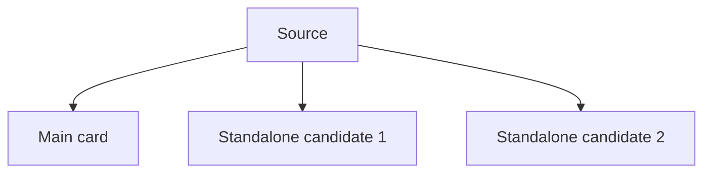

# Planning Review - [Source Title]

Use this single file for owner review before any project is created.

## Source Snapshot
- sourceId:
- brand:
- sourceType:
- input:
- transcript status:
- estimated length:
- planning note:

## Core Theme
- main thesis:
- why this source matters:
- editorial opportunity:

## Insight Extraction
- raw insight count:
- filtered usable insight count:
- summary-style carousel viability:

### Raw Insights
- insight 1:
- insight 2:

### Filter Notes
- merged:
- cut:
- why:

### Richesse Scoring Summary
Use when the active brand is `richesse-club`.

| insight | Brand Fit (1-5) | Content Value (1-5) | Novelty (1-5) | Evidence Strength (1-5) | Slide-worthiness (1-5) | keep / cut |
| --- | --- | --- | --- | --- | --- | --- |
| insight 1 |  |  |  |  |  |  |

## Main Topic
### Umbrella Slide Subtopics
- subtopic 1:
  - role in main card:
  - why it stays inside the main card:

### Standalone-Worthy Subtopics
- candidateId:
  - standalone angle:
  - why it can survive on its own:
  - relation to the main card:

## Packaging Map

## Candidate Scoreboard
| candidateId | packaging | priority | slides | status | note |
| --- | --- | --- | --- | --- | --- |
| `candidate-slug` | umbrella | P1 | 7 | ready | main card |

## Candidate Plans

### Candidate Name
- candidateId: `candidate-slug`
- workingTitle:
- packaging: umbrella | standalone | series-only | reject
- reviewStatus: ready | hold | reject
- slideCount:
- contentAngle:
- whyItDeservesAPost:
- recommendedPriority: P1 | P2 | P3

#### Audience

#### Core Message

#### Why Now

#### Key Point 1

#### Key Point 2

#### Key Point 3

#### Hook

#### Closing Note

#### Slide Flow
- Slide 1 (Cover):
- Slide 2:
- Slide 3:
- Slide 4:
- Final:

#### Visual Direction

## Recommended Route
- main card recommendation:
- why:
- standalone expansion candidates:
- hold:
- reject:

## Approval Guide
- main card:
- standalone candidates:
- spawn now:
- hold:
- reject:
- next step after approval:
